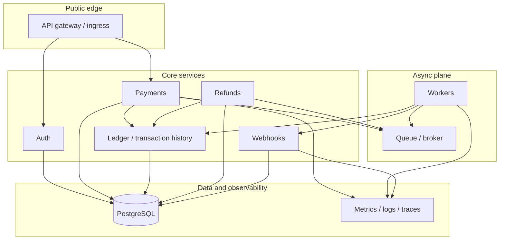

# PayFlow — Portfolio platform requirements (fintech SaaS / DevOps)

## Problem Frame

The portfolio needs a credible, interview-ready narrative for operating a **multi-tenant B2B payments SaaS** where reliability, security, auditability, and controlled change matter as much as feature breadth. The work is **not** a full Stripe clone; it is a **bounded product surface** with **strong operational and governance story** (environments, CI/CD gates, observability, failure playbooks, tenant isolation).

**Primary audiences:** hiring managers and senior DevOps/SRE interviewers evaluating platform judgment, not end-merchant product completeness.

**Portfolio alignment (EU hiring signals):** The repository split and non-functional requirements are shaped to surface the same themes common in EU senior/staff platform roles: **Azure-first** managed Kubernetes (**AKS**), **Terraform** for IaC, **multi-stage CI/CD** with **manual production gates**, **OIDC or short-lived credentials** from pipelines to cloud (no long-lived CI secrets in repos), **secret management**, **network segmentation** (VNET-style hub/spoke or regional VNET as designed), **Prometheus/Grafana-class observability**, **SLIs/SLOs** for at least one user-facing path, and **scripted plus application-language** automation. GitHub Actions is the **default** CI/CD reference; **GitLab CI** or **Azure DevOps** may appear as **documented alternates** or secondary workflows where it strengthens the story without duplicating every job.

## Requirements

**Product surface (merchant-visible behavior)**

- R1. Merchants can register and obtain **tenant-scoped** API credentials suitable for programmatic integration.
- R2. **Dashboard users** authenticate separately from **API clients** (dual auth model: human session/JWT-style access vs API keys or equivalent for integrations). An **RBAC model** is documented (roles such as merchant admin vs operator, which actions each role may perform, and whether a break-glass or platform-admin role exists) so authorization and audit requirements stay grounded.
- R3. Merchants can **create payment requests**, **query payment status**, and **request refunds**; all operations are **logically isolated per tenant** (no cross-tenant read or write).
- R4. **Idempotency** is required for **payment submission**: retries with the same idempotency key return the **same logical outcome** as the first successful interpretation of that key (no duplicate financial effect for the same key). **Refund requests** use the same idempotency-key rule where the API exposes a refund endpoint (same key → same logical refund outcome); if refunds are modeled only as idempotent-by-payment-reference, that contract is documented explicitly in planning so interviews have a single clear story.
- R5. **Transaction history** is explainable via an **append-style ledger of domain events** (for example: payment created, authorized, settled, refund requested, refund completed — exact event names are not fixed here).
- R6. Merchants can **register webhook endpoints**; the platform **signs** outbound webhook deliveries, **retries** transient failures with bounded behavior, **records delivery state**, and moves persistently failing deliveries to a **dead-letter path**. **DLQ visibility in v1** is **minimal**: list failed deliveries with reason and timestamps, plus detail view; **replay** or bulk re-drive is optional. Merchant-facing vs operator-only visibility follows the RBAC model in R2 (either is acceptable if documented).
- R7. A **lightweight dashboard** exists for merchant or admin operations that are awkward to demonstrate via API alone (health, key flows, operational views), without making frontend depth the primary goal. R6’s DLQ views stay within this “lightweight” bar unless a later phase explicitly expands operator tooling.

**Security and trust boundaries**

- R8. **Tenant-scoped authorization** on every mutating and sensitive read path (object-level access must always resolve through tenant context derived from authenticated identity).
- R9. **Secrets** (DB credentials, signing material, webhook secrets) are **not** stored in plaintext in git-tracked config; runtime injection via a secrets mechanism appropriate to the deployment model is required. **CI/CD to cloud authentication** uses **OIDC / workload federation–style** short-lived credentials (or the closest supported equivalent on the chosen cloud) rather than static cloud user keys committed or stored as long-lived pipeline variables where avoidable.
- R10. **Encryption in transit** for external APIs; **encryption at rest** for managed data stores where the chosen cloud/database supports it without heroic custom crypto.
- R11. **Audit logging** for security-relevant actions, including at minimum: dashboard login success and failure, API key authentication failure, API key issuance/rotation/revocation, payment and refund mutations, RBAC or permission changes, and any documented break-glass or platform-admin actions from R2.
- R12. **No storage of raw payment card data** (PAN/CVV); use **mock or tokenized** payment payloads suitable for a portfolio demonstration.

**Reliability and correctness**

- R13. Payment processing has an **asynchronous stage** after initial validation and persistence so the design can discuss **safe retries**, **at-least-once delivery** to workers, and **idempotent** downstream handling. Planning documents per-consumer assumptions (which operations must be strictly idempotent under redelivery).
- R14. Documented **failure scenarios** exist with **expected system behavior**, captured as **runbooks or scenario docs** tied to observable signals, covering at least: **(1)** duplicate submission / client retry on payment create (idempotency), **(2)** worker crash mid-job (safe redelivery), **(3)** **database connection saturation** or overload (alerts, latency, backpressure or shedding behavior as designed), **(4)** webhook target unavailable (backoff, DLQ), **(5)** bad deployment (detection, rollback narrative), **(6)** cluster maintenance / **node drain** (PDB preserving availability). Naming in success criteria S5 matches this list.
- R15. **AKS** (or the documented managed Kubernetes offering) demonstrates **readiness/liveness probes**, **HPA** for at least one scalable tier, **PDBs** for at least one critical deployment, **NetworkPolicy**-style segmentation where the cluster/CNI supports it, **ingress with TLS**, and workload **RBAC** that is not gratuitously cluster-admin.

**Platform, environments, and change governance**

- R16. **Infrastructure as code (Terraform)** defines **Azure** network segmentation (**VNET** with public/private separation or equivalent documented topology), **AKS**, managed **PostgreSQL**, load balancing (**Azure LB / Application Gateway** as appropriate), DNS/TLS hooks, **Key Vault** (or equivalent) integration for secrets, and **object storage** for artifacts/reports where the narrative needs it.
- R17. At least **three named environments** — **dev**, **staging**, **prod** — with **documented differences** in cost posture, controls, and promotion expectations (staging is rehearsal for prod; prod has stronger gates and alerting).
- R18. CI/CD runs **static checks**, **tests**, **security scans** (dependencies, container images, secret detection), **build/publish** artifacts, **planned infra changes** where Terraform applies, **deploy to staging** automatically on mainline merges or equivalent policy, **post-deploy smoke checks**, and a **human approval gate before production deploy** modeled with **GitHub Actions environments**; documentation names how the same gates map to **GitLab protected environments** or **Azure DevOps environments/approvals** for readers on those stacks.
- R19. **Rollback** path is documented and automatable enough to demonstrate in an interview (what triggers rollback, how image/version reversion works, who approves).

**Observability**

- R20. **Platform metrics** cover latency, errors, saturation, restarts, queue depth/backlog, and DB connection pressure where accessible. At least one **SLO-style** articulation exists (for example: availability or p95 latency **SLI** with **error budget** language) for a documented user-facing path (payment API or webhook delivery).
- R21. **Business metrics** include per-tenant traffic and payment/refund/webhook outcomes suitable for Grafana-style dashboards (executive, platform/SRE, and tenant ops views as separate dashboard groupings).
- R22. **Structured logs** include correlation identifiers (`request_id`, `trace_id` where tracing exists), `tenant_id`, payment identifiers, `service_name`, and `event_type` for audit and debugging narratives.
- R23. **Distributed tracing** across gateway → payment → queue → worker → webhook is **desired**; if omitted in early layers, the requirements doc states the gap explicitly until implemented.

**Compliance posture (language discipline)**

- R24. Documentation uses **PCI DSS–aligned principles** language (least privilege, segmentation, audit logging, controlled access, encryption, retention thinking) and **does not** claim formal PCI compliance or certification for this portfolio build.

**Repository shape (four repos by change lifecycle)**

- R25. The portfolio is organized as **four separate repositories** (each buildable and explainable on its own in interviews), with **this workspace** acting as the **parent checkout** or **documentation hub** until remotes are created:
  - **`payflow-terraform-modules`:** Reusable Terraform modules (VNET, AKS, Postgres, observability baseline, IAM-ish patterns). Proves **IaC design**, **module boundaries**, and **versioned platform abstractions**.
  - **`payflow-infra-live`:** Root modules per environment (`envs/dev`, `envs/staging`, `envs/prod`), remote state, promotion policy. Proves **blast-radius control**, **environment separation**, and **Terraform plan/apply governance**.
  - **`payflow-platform-config`:** Kubernetes manifests or Helm/Kustomize, **HPA/PDB/NetworkPolicy**, ingress, **monitoring/alerting/dashboards** as code. Proves **cluster operations**, **GitOps or pipeline-driven deploy** (planning chooses), and **SRE observability**.
  - **`payflow-app`:** Services (auth, payment, refund, ledger, webhook, worker), contracts, migrations, application CI (build/test/scan/publish images). Proves **delivery automation**, **application correctness** (idempotency, tenancy), and **secure SDLC** hooks.
- R26. A short **matrix doc** in-repo maps **each repository** to the **EU job responsibility bullets** it is intended to demonstrate (design/build cloud, IaC, CI/CD, K8s lifecycle, reliability/security/observability, collaboration with app teams). **Artifact:** `docs/portfolio-signals.md`, plus each repo’s `README.md`.

## Success Criteria

- S1. A reader can follow **one end-to-end payment journey** from API through async processing to webhook delivery with **stated guarantees** around idempotency and retries.
- S2. **Tenant A cannot access Tenant B’s resources** in automated tests or documented manual checks.
- S3. **Production deploys** require an explicit **approval gate**; staging does not.
- S4. **Dashboards or alert rules** exist that combine **platform health** and **business KPIs** (payment success, webhook failures, per-tenant volume).
- S5. **Runbooks** exist for the **six** scenario classes listed in R14 (duplicate submission / idempotent retry, worker crash mid-job, database saturation, webhook target down, bad deployment, node drain / maintenance) with **signals** and **expected mitigations**.
- S6. Each of the four repositories has a **README** that reads as an **internal engineering overview** for that slice (purpose, boundaries, how it connects to the other repos, security and operations notes), not only a tutorial.

## Scope Boundaries

- N1. Not a production payment processor; **no real card data**, no real money movement, no compliance certification claims.
- N2. Not full card network / acquirer / processor integrations; **simulated** payment state machine is sufficient.
- N3. Not exhaustive fintech product scope (disputes, chargeback lifecycle, FX, multi-currency tax, global licensing) unless explicitly pulled into a later phase.
- N4. A **single all-in-one monorepo** as the long-term shape is out of scope; the **default** organization is the **four-repo** model in R25 (a temporary meta-folder layout in one workspace is acceptable until git remotes are split).

## Key Decisions

- **Four repositories by change lifecycle (R25):** Application code, reusable Terraform modules, live environment definitions, and Kubernetes/platform observability config are **separated** so interviews can discuss **ownership**, **review cadence**, and **blast radius** the same way EU platform roles describe production practice.
- **Azure-first (AKS + VNET + Key Vault patterns):** Default cloud narrative for this portfolio is **Microsoft Azure** to align with common EU job postings (**AKS**, Resource Groups, VNETs); portable equivalents (AWS/GCP) are optional **deferred** experiments, not the primary story, unless planning explicitly reverses this for your target market.
- **Shared PostgreSQL with strict tenant scoping:** Logical isolation via tenant context in application and authorization layers; physical per-tenant schemas are not required for the initial narrative.
- **Async payment pipeline:** Separates fast API acknowledgment from background processing to foreground idempotency, retries, and observability topics credibly.
- **Dual authentication model:** Separates human dashboard access from merchant API integration access.
- **Ledger-style events:** History is explained through append-oriented domain events rather than only a mutable status column.
- **PCI-aligned wording only:** Reference framework controls as design influences, not certification.

## Dependencies / Assumptions

- This repository workspace was **empty at brainstorm time** (no pre-existing services or infra to extend); folder names under the workspace root are **scaffolds** for the four future git repositories, not claims that separate remotes already exist.
- **Slack organizational context** was not available in this session (no Slack MCP); no organizational constraints were merged from Slack.
- **Application language/runtime** (for example Go, Java, TypeScript) is selected in planning; the portfolio must include **both** scripted automation (shell/Make/Python for glue) **and** at least one **object-oriented or strongly structured** service language where job descriptions ask for OOP plus scripting.

## Outstanding Questions

### Resolve Before Planning

- (none)

### Deferred to Planning

- [Affects R16,R17][Technical] Concrete **Azure region**, SKU, and sizing choices (AKS node pools, Postgres tier, ingress controller selection).
- [Affects R7,R22][Technical] Frontend stack depth and auth session technology for dashboard users.
- [Affects R13][Technical] Message broker choice and exactly-once vs at-least-once semantics per component.
- [Affects R23][Needs research] Tracing backend and collector topology for the chosen environment.
- [Affects R18][Technical] Whether GitOps (Argo CD/Flux) appears in phase 2 vs pipeline-driven deploy only.

## Next Steps

`-> /ce:plan` for structured implementation planning grounded in this repo layout and phased delivery (Layer 1: runnable core + DB + local dev; Layer 2: Terraform + Kubernetes + CI/CD; Layer 3: observability + security hardening + audit completeness; Layer 4: failure simulations + runbook drill + compliance narrative polish).
