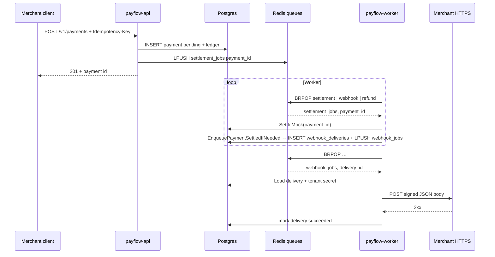

# PayFlow async plane — Redis queues, worker BRPop, and outbound webhooks

## Context

`payflow-app` splits **synchronous HTTP** (API) from **asynchronous work** (mock settlement, refund settlement, merchant webhooks). Locally, **Redis lists** back the same publisher interface intended for **Azure Service Bus** in cloud environments. The normative contract lives in `docs/contracts/async-plane.md`; this note adds a **single mental model** and a **diagram** so the next debugging session starts from wiring, not guesswork.

## Guidance

### Queues and keys (Redis v1)

| Redis list key | Producer | Payload | Consumer branch |
|----------------|----------|---------|-----------------|
| `payflow:settlement_jobs` | `queue.PublishPaymentSettlement` (API after payment create) | Payment UUID string | `payment.SettleMock` → enqueue payment-settled webhook if configured |
| `payflow:refund_jobs` | `queue.PublishRefundSettlement` (API after refund create) | Refund UUID string | `refund.SettleMock` → enqueue `refund.succeeded` webhook if configured |
| `payflow:webhook_jobs` | `queue.PublishWebhookDelivery` (after delivery row inserted) | Webhook delivery UUID string | `webhook.ProcessDelivery` (HTTP POST + retries / DLQ) |

Worker entrypoint: `internal/queue/Redis.BRPopJob` **blocks** on **all three** lists with one `BRPOP`, then dispatches on the list key that returned a job (`cmd/worker/main.go`).

### Detail diagram (component + sequence)

**Component view** (who talks to whom):

```mermaid
flowchart LR
  subgraph API["cmd/api"]
    H[HTTP handlers]
  end
  subgraph DB[(PostgreSQL)]
    P[payments]
    R[refunds]
    L[ledger_events]
    W[webhook_deliveries]
    T[tenants]
  end
  subgraph Redis["Redis"]
    Q1["payflow:settlement_jobs"]
    Q2["payflow:refund_jobs"]
    Q3["payflow:webhook_jobs"]
  end
  subgraph Worker["cmd/worker"]
    BR[BRPopJob]
    SM[SettleMock payment]
    SR[SettleMock refund]
    PD[ProcessDelivery]
  end
  H -->|write + enqueue| DB
  H -->|LPUSH| Q1
  H -->|LPUSH| Q2
  BR -->|BRPOP| Q1
  BR -->|BRPOP| Q2
  BR -->|BRPOP| Q3
  SM --> DB
  SM -->|insert row + LPUSH| Q3
  SR --> DB
  SR -->|insert row + LPUSH| Q3
  PD -->|HTTPS| M[Merchant URL]
  PD --> DB
  H -.->|JWT / API key| T
```

**Sequence view** (happy path: payment → settle → webhook):



### Idempotency reminders (worker-safe)

- **Settlement / refund settlement:** ledger append uses **dedupe keys** (`payment_id`-scoped and `refund:{id}:…` patterns) so duplicate queue deliveries do not double-apply money-side effects.
- **Webhooks:** `webhook_deliveries` dedupes **enqueue** on `(tenant_id, merchant_idempotency_key)`; the merchant still dedupes **side effects** (contract in `async-plane.md`).

## Why this matters

Misunderstanding which queue a job landed on leads to “worker is running but nothing happens” (wrong Redis DB), “webhook never sent” (tenant missing `webhook_url` / secret), or “double ledger row” fears when the real issue is **redelivery** — the diagrams above anchor those questions to **three list names** and **one BRPOP fan-in**.

## When to apply

- Local `docker compose` with Redis: confirm **`REDIS_URL`** matches between API and worker.
- After changing `internal/queue` constants: update **this doc’s table** and `payflow-platform-config` docs if queue names are duplicated there.
- Before comparing to **Service Bus**: re-read broker differences in `docs/contracts/async-plane.md` (ordering, DLQ semantics).

## Examples

- **Payment stuck `pending`:** API logs show create succeeded but worker not running → no consumer on `payflow:settlement_jobs`.
- **Webhook DLQ:** merchant returns 5xx until `max_attempts` → row `status=dlq`; list via MeAuth `GET /v1/webhook-deliveries?status=dlq` (see OpenAPI).

## Related

- `docs/contracts/async-plane.md` — normative async + webhook contract (signing, rotation, merchant dedupe).
- `docs/plans/payflow-platform-plan.md` — Units 5–8 scope.
- Code: `payflow-app/internal/queue/queue.go`, `cmd/worker/main.go`, `internal/webhook/webhook.go`, `internal/payment/payment.go`, `internal/refund/refund.go`.
